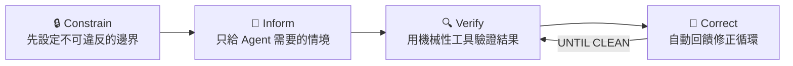
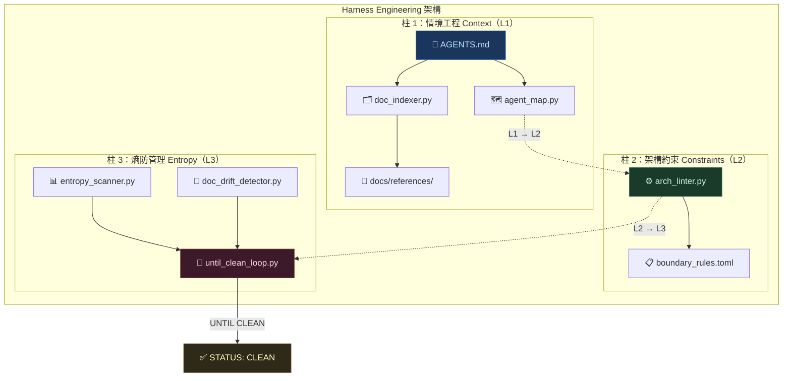
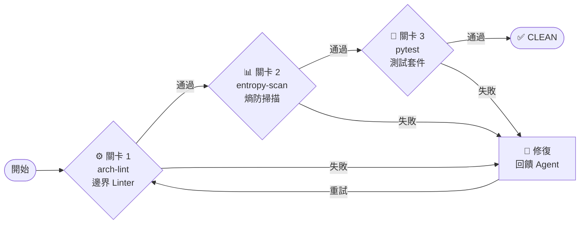

# 🏗️ Harness Engineering 完整規範書

> **版本**: v1.0.0  
> **來源**: [OpenAI Harness Engineering (2026-02-11)](https://openai.com/index/harness-engineering/)  
> **實作參考**: Hantindexharness Engineering 專案  
> **適用對象**: 所有需要「AI Agent 參與開發」的軟體工程專案  
> **核心理念**: **Constrain → Inform → Verify → Correct**

---

## 目錄

1. [什麼是 Harness Engineering？](#1-什麼是-harness-engineering)
2. [核心哲學：第一性原理](#2-核心哲學第一性原理)
3. [三大柱架構總覽](#3-三大柱架構總覽)
4. [柱 1：情境工程 Context Engineering](#4-柱-1情境工程-context-engineering)
5. [柱 2：架構約束 Architectural Constraints](#5-柱-2架構約束-architectural-constraints)
6. [柱 3：熵防管理 Entropy Management](#6-柱-3熵防管理-entropy-management)
7. [UNTIL CLEAN 閉環驗證迴圈](#7-until-clean-閉環驗證迴圈)
8. [AGENTS.md 撰寫規範](#8-agentsmd-撰寫規範)
9. [boundary_rules.toml 規格定義](#9-boundary_rulestoml-規格定義)
10. [標準目錄結構模板](#10-標準目錄結構模板)
11. [新專案導入檢查清單](#11-新專案導入檢查清單)
12. [反模式與常見錯誤](#12-反模式與常見錯誤)
13. [實戰案例：Pac-Man AI 驗證系統](#13-實戰案例pac-man-ai-驗證系統)
14. [附錄：名詞對照表](#14-附錄名詞對照表)

---

## 1. 什麼是 Harness Engineering？

**Harness Engineering**（韁繩工程）是 OpenAI 於 2026 年 2 月 11 日發表的軟體工程方法論，專門解決「AI Agent 如何可靠地完成複雜工程任務」這個問題。

### 1.1 問題意識

傳統 AI 輔助開發面臨三個根本問題：

| 問題 | 表現 | 根因 |
|---|---|---|
| **幻覺** | Agent 編造不存在的 API 或函式 | 缺乏情境約束，Agent 憑「記憶」而非「事實」工作 |
| **越界** | Agent 修改不該碰的模組或引入禁止依賴 | 缺乏機械性護欄，僅依賴 prompt 提示 |
| **衰退** | 系統隨開發迭代逐漸變髒（技術債累積） | 缺乏持續的熵監控與自動修復機制 |

### 1.2 核心答案

> **不要信任 Agent 的判斷力，而是設計一套「韁繩」讓 Agent 不可能犯錯。**

Harness Engineering 的答案是三根柱子 + 一個閉環迴圈：

```
┌──────────────────────────────────────────────────────────┐
│                                                          │
│   柱 1：情境工程       →  告訴 Agent「看什麼」          │
│   柱 2：架構約束       →  不讓 Agent「做錯事」          │
│   柱 3：熵防管理       →  持續偵測「系統在變髒嗎？」     │
│   UNTIL CLEAN 迴圈    →  「改到乾淨為止才停」           │
│                                                          │
└──────────────────────────────────────────────────────────┘
```

---

## 2. 核心哲學：第一性原理

### 2.1 為什麼是「韁繩」而不是「指令」？

```
指令式思維（❌ 脆弱）:
  「請不要引用 entropy 模組」
  → Agent 可能忘記、忽略、或重新解釋這條規則

韁繩式思維（✅ 穩固）:
  AST Linter 掃描所有 import → 違反邊界規則 → exit code 1 → CI 流程中斷
  → Agent 根本無法提交違規程式碼
```

**關鍵區別**：指令是給人的建議，韁繩是機械性的物理約束。

### 2.2 Constrain → Inform → Verify → Correct

這是 Harness Engineering 的四步驟工作哲學：



| 步驟 | 含義 | 實作手段 |
|---|---|---|
| **Constrain** | 先劃定邊界，而不是事後檢查 | `boundary_rules.toml` + AST Linter |
| **Inform** | 漸進披露，只給當前任務需要的文件 | `AGENTS.md` → `agent_map.py` |
| **Verify** | 用程式驗證，不依賴 Agent 自我宣稱 | `arch-lint` + `entropy-scan` + `pytest` |
| **Correct** | 失敗不停止，自動重試修正 | `until_clean_loop.py` |

---

## 3. 三大柱架構總覽



### 3.1 嚴格層次邊界（最核心規則）

```
L1 context    → 不可引用 L2, L3（最底層，零依賴）
L2 constraints → 可引用 L1；不可引用 L3
L3 entropy    → 可引用 L1, L2（最高層，可使用所有下層）
```

**為什麼這很重要？**

- 低層模組（L1）是「基礎設施」，被所有上層依賴，因此不能引入上層的複雜度
- 高層模組（L3）依賴低層是自然的，因為它需要整合所有能力
- 這確保了**單向依賴流**，消除了循環依賴和隱式耦合

---

## 4. 柱 1：情境工程 Context Engineering

### 4.1 核心概念

> **不是把所有知識塞給 Agent，而是只在正確的時間給正確的文件。**

情境工程解決的問題是：AI Agent 的 context window 有限，如果一次性塞入全部程式碼和文件，Agent 會「資訊過載」導致關鍵資訊被忽略。

### 4.2 漸進式情境披露（Progressive Disclosure）

```
❌ 反模式：把 ARCHITECTURE.md（500 行）+ README.md + 所有源碼一次塞入 prompt
✅ 正模式：用 AGENTS.md（~100 行）做路由，只給 Agent 當前任務需要的 3-5 個文件路徑
```

**漸進披露的實作層次**：

```
第 1 層：AGENTS.md（任務路由表，~100 行）
  ├── 告訴 Agent「去哪裡找」，而不是「所有知識」
  └── 根據任務關鍵字導向精確的文件路徑

第 2 層：agent_map.py（任務路由引擎）
  ├── 解析 AGENTS.md 的路由段落
  ├── 使用關鍵字重疊度進行任務匹配
  └── 返回按相關性排序的文件引用列表

第 3 層：doc_indexer.py（BM25 文件索引）
  ├── 對 docs/references/ 建立離線搜尋索引
  ├── 支援中英文混合查詢
  └── 零外部依賴（僅使用 math、re 標準庫）
```

### 4.3 AGENTS.md 的定位

**AGENTS.md 不是百科全書，它是路由器**。

| 屬性 | 正確做法 | 錯誤做法 |
|---|---|---|
| 長度 | ~100 行，精簡的路由表 | 500+ 行的詳盡文件 |
| 內容 | 「去哪裡找」的指引 | 複製貼上所有文件內容 |
| 風格 | 條件式路由（if 任務是 X → 看 Y） | 線性文件（從頭到尾讀） |
| 更新頻率 | 低（結構穩定後很少改動） | 高（不應隨程式碼頻繁改動） |

### 4.4 實作規範

#### `agent_map.py` 必須具備的能力

```python
class AgentMap:
    def load(self) -> bool:
        """載入並解析 AGENTS.md"""
        ...

    def query_context(self, task: str) -> list[DocReference]:
        """
        漸進披露的核心方法。
        根據任務描述的關鍵字重疊度匹配，返回最相關的文件引用。

        Args:
            task: 使用者的任務描述
        Returns:
            按相關性排序的 DocReference 列表
        """
        ...
```

#### `doc_indexer.py` 必須具備的能力

```python
class DocIndexer:
    def build_index(self, directory: Path) -> int:
        """掃描目錄下所有文件，建立 BM25 索引"""
        ...

    def search(self, query: str, top_k: int = 5) -> list[SearchResult]:
        """BM25 關鍵字搜尋，支援中英文混合查詢"""
        ...
```

---

## 5. 柱 2：架構約束 Architectural Constraints

### 5.1 核心概念

> **用程式碼約束取代 prompt 提示。Agent 不是「不該」違反邊界，而是「不可能」違反。**

架構約束的核心思想：**機械性約束（Mechanical Constraint）**。以下是理解關鍵：

```
Prompt 約束（脆弱）：
  「請記得不要在 context 層引用 entropy 模組」
  → Agent 可能忘記 → 違規被合併 → 系統耦合

機械性約束（穩固）：
  arch_linter.py 用 AST 解析 import
  → 發現 context 引用 entropy
  → exit 1
  → CI 流程中斷
  → Agent 必須修正才能繼續
```

### 5.2 boundary_rules.toml — 邊界規則的定義格式

```toml
# 邊界規則定義（嚴格模式）
[meta]
mode = "strict"
version = "1.0.0"
description = "嚴格層次邊界規則 - 機械性強制，非 prompt 依賴"

[[layers]]
name = "context"
path_pattern = "src/your_project/context"
level = 1
description = "情境工程層（最底層）"
forbidden_imports_from = [
    "your_project.constraints",
    "your_project.entropy",
]
severity = "error"

[[layers]]
name = "constraints"
path_pattern = "src/your_project/constraints"
level = 2
description = "架構約束層"
forbidden_imports_from = [
    "your_project.entropy",
]
severity = "error"

[[layers]]
name = "entropy"
path_pattern = "src/your_project/entropy"
level = 3
description = "熵防管理層（最高層）"
forbidden_imports_from = []
severity = "error"
```

### 5.3 arch_linter.py — AST 靜態分析器

Linter 的核心演算法：

```python
# 虛擬碼展示核心邏輯
def lint_file(file_path: Path) -> list[Violation]:
    # 1. 根據路徑判斷所屬層次
    layer = detect_layer(file_path)  # e.g., "context"

    # 2. 查詢該層的禁止引用列表
    forbidden = boundary_rules[layer]["forbidden_imports_from"]

    # 3. 用 ast.parse 提取所有 import 語句
    imports = extract_imports(file_path)

    # 4. 逐一比對
    violations = []
    for module, line_no in imports:
        for forbidden_module in forbidden:
            if module == forbidden_module or module.startswith(forbidden_module + "."):
                violations.append(Violation(file_path, line_no, module))

    return violations
```

**關鍵設計原則**：

| 原則 | 說明 |
|---|---|
| 使用 AST，不用正則 | `import X` 和 `from X import Y` 都能正確捕獲 |
| 前綴匹配 | `"harness.entropy"` 同時匹配 `harness.entropy` 和 `harness.entropy.scanner` |
| exit code 語義 | `0` = 乾淨，`1` = 有 error 違規（可整合 CI/CD） |
| 跳過 `__init__.py` | 避免對匯出模組的誤報 |

### 5.4 嚴格模式 vs 寬鬆模式

| 模式 | 適用場景 | 邊界規則 |
|---|---|---|
| **嚴格模式（strict）** | 生產專案、架構敏感型系統 | L1 禁引 L2/L3，L2 禁引 L3 |
| **寬鬆模式（relaxed）** | 小型原型、概念驗證 | 禁止循環引用，但允許跨層 |

> [!IMPORTANT]
> **建議所有新專案從嚴格模式開始。** 從嚴格放寬容易，從寬鬆收緊困難（既有程式碼已經耦合）。

---

## 6. 柱 3：熵防管理 Entropy Management

### 6.1 核心概念

> **軟體系統永遠趨向混亂（熵增），你需要一個偵測器持續監控並量化這個趨勢。**

「熵」在這裡是一個比喻：系統隨著開發迭代會自然地變髒——文件過期、TODO 累積、測試缺失、架構漂移——如果不主動偵測和修復，系統品質會不斷衰退。

### 6.2 四個觀測維度

```
╔══════════════════════════════════════════════════════════════╗
║                     系統熵防四維度觀測                        ║
╠══════════════════════════════════════════════════════════════╣
║                                                              ║
║  📋 技術債（Technical Debt）                                 ║
║     偵測 TODO / FIXME / HACK / XXX 密度                      ║
║     量化公式：密度 = (count / total_lines) × 100              ║
║     閾值：≥5.0 = critical  ≥2.0 = warning  <2.0 = info       ║
║                                                              ║
║  🧪 缺失測試（Missing Tests）                                ║
║     每個 src/*.py 模組必須有對應 tests/test_*.py              ║
║     缺失 = warning 級指標                                     ║
║                                                              ║
║  📅 文件過期（Document Staleness）                            ║
║     偵測 docs/ 下超過 N 天未更新的 .md 文件                    ║
║     預設閾值：30 天                                           ║
║                                                              ║
║  🏗️ 結構完整性（Structural Integrity）                       ║
║     Harness 必要文件是否全部存在                               ║
║     缺失必要文件 = critical 級指標                             ║
║                                                              ║
╚══════════════════════════════════════════════════════════════╝
```

### 6.3 entropy_scanner.py — 熵狀態掃描器

**核心輸出**：`EntropyReport`

```python
@dataclass
class EntropyReport:
    indicators: list[EntropyIndicator]  # 所有熵指標
    todo_count: int                      # TODO/FIXME 數量
    missing_tests: list[str]             # 缺失測試的模組路徑
    stale_docs: list[str]                # 過期文件路徑
    missing_harness_files: list[str]     # 缺失的 Harness 必要文件

    @property
    def is_clean(self) -> bool:
        """無 critical 指標 = 乾淨"""
        return not any(ind.severity == "critical" for ind in self.indicators)

    @property
    def entropy_score(self) -> float:
        """加權熵分數：critical×10 + warning×3 + info×1"""
        ...
```

**Harness 必要文件清單**（缺失任一 = critical）：

```python
REQUIRED_HARNESS_FILES = [
    "AGENTS.md",                              # 任務路由地圖
    "pyproject.toml",                          # 依賴管理
    "docs/constitution/PROJECT_CONSTITUTION.md", # 專案憲法
    "docs/architecture/ARCHITECTURE.md",        # 主架構書
]
```

### 6.4 doc_drift_detector.py — 文件漂移偵測

解決的問題：**文件描述 ≠ 程式碼現實**。

```
情境：工程師新增了 auth/ 模組，但 ARCHITECTURE.md 沒有同步新增
結果：doc_drift_detector 偵測到 ARCHITECTURE.md 中缺少 auth/ 的描述
輸出：warning 級指標：「模組 auth 存在於 src/ 但未在 ARCHITECTURE.md 中記載」
```

---

## 7. UNTIL CLEAN 閉環驗證迴圈

### 7.1 核心概念

> **以「終止條件」驅動，而不是「步驟列表」驅動。**

傳統方式：「步驟 1 → 步驟 2 → 步驟 3 → 完成」  
UNTIL CLEAN：「重複執行 → 直到所有檢查通過才停止」

```
REPEAT
  1. 執行架構邊界 Linter（arch-lint）
  2. 執行熵防掃描（entropy-scan）
  3. 執行測試套件（pytest）
UNTIL all_pass == True OR iterations >= MAX_ITERATIONS
```

### 7.2 三道關卡



| 關卡 | 工具 | 通過條件 | 失敗時 |
|---|---|---|---|
| 1. 邊界 Linter | `uv run arch-lint` | `is_clean == True`（零 error 違規） | exit 1，輸出違規清單 |
| 2. 熵防掃描 | `uv run entropy-scan` | `is_clean == True`（零 critical 指標） | 列出 critical 指標供修復 |
| 3. 測試套件 | `uv run pytest tests/ -v` | `returncode == 0`（全通過） | 輸出失敗測試的最後 5 行 |

### 7.3 迭代上限與升級機制（Escalation）

```python
MAX_ITERATIONS = 10  # 最大迭代次數

# 達到上限仍未 CLEAN → 立即通知工程師
if not status.is_clean:
    print("❌ SYSTEM STATUS: DIRTY")
    print(f"已達到最大迭代次數 ({MAX_ITERATIONS})，系統仍未 CLEAN。")
    print("請通知工程師介入處理。（Escalation）")
    sys.exit(1)
```

### 7.4 UNTIL CLEAN 的哲學意義

```
傳統開發模型：
  Agent 收到任務 → 執行 → 交付 → 結束
  （不管結果是否正確）

UNTIL CLEAN 模型：
  Agent 收到任務 → 執行 → 驗證 → 失敗 → 修復 → 驗證 → 失敗 → ... → 驗證 → 通過 → 交付
  （只有 CLEAN 了才允許交付）
```

這模擬了「負責任的工程師」的行為：不是做完就走，而是做到正確才走。

---

## 8. AGENTS.md 撰寫規範

### 8.1 完整模板

```markdown
# AGENTS.md — [專案名稱]
# 任務地圖（OpenAI Codex 格式，~100 行）
# 版本: v[X.Y.Z] | 生效: [YYYY-MM-DD]

## 你的角色（Your Role）

你是本專案的 AI 工程助理，在 **Harness Engineering** 框架內工作。
核心工作原則：**Constrain → Inform → Verify → Correct**

## 關鍵規則（Critical Rules）

- 如果資訊不在這個 repository 中，視作不存在
- 完成任何實作前，先查閱對應的 docs/ 文件
- 每完成一個模組，必須執行 `[測試命令]` 確認全數通過
- 禁止使用 `pass`、`# TODO`、stub 函式交付功能

## 領域地圖（Domain Map）

| 領域 | 路徑 | 職責 |
|---|---|---|
| [領域1] | `src/[path]/` | [職責說明] |
| [領域2] | `src/[path]/` | [職責說明] |

## 邊界規則（Boundary Rules — 嚴格模式）

本專案實施**嚴格層次架構**（定義於 `[rules_path]`）：

\```
context（第 1 層）← 不可引用任何內部模組
constraints（第 2 層）← 只可引用 context
entropy（第 3 層）← 可引用 context 和 constraints
\```

違反規則 = 立即執行 `[lint_command]` 確認並修復

## 任務路由（Task Routing）

### 如果你的任務是「[任務類型A]」
→ 閱讀：`[文件路徑]`
→ 參考：`[參考路徑]`

### 如果你的任務是「[任務類型B]」
→ 使用：`[工具路徑]`
→ 執行：`[執行命令]`

## 核心驗證指令（Verification Commands）

\```bash
[cmd1]  # 全套測試
[cmd2]  # 架構邊界 Linter
[cmd3]  # 熵防掃描
[cmd4]  # UNTIL CLEAN 完整驗證
\```

## 何時停止並通知工程師（Escalation）

立即停止並通知工程師，如果：
- 架構 linter 連續失敗超過 3 次
- 需要修改專案憲法
- 需要新增外部依賴
- 測試失敗原因超出模組範圍
```

### 8.2 撰寫原則

| 原則 | 說明 | 範例 |
|---|---|---|
| **精簡路由** | ~100 行以內，告訴 Agent 「去哪找」 | `→ 閱讀：docs/architecture/ARCHITECTURE.md` |
| **條件式導航** | 用「如果...」結構做任務分流 | `### 如果你的任務是「修復測試失敗」` |
| **機械性規則** | 邊界規則寫清楚，不留模糊空間 | `context（第 1 層）← 不可引用任何內部模組` |
| **升級門檻** | 明確定義「何時通知人類」 | `linter 連續失敗超過 3 次` |

---

## 9. boundary_rules.toml 規格定義

### 9.1 完整欄位說明

```toml
[meta]
mode = "strict"                    # 模式：strict / relaxed
version = "1.0.0"                  # 規則版本
description = "邊界規則描述"        # 人可讀說明
created_at = "2026-01-01"          # 建立日期

[[layers]]
name = "layer_name"                # 層次名稱（唯一識別符）
path_pattern = "src/project/layer" # 路徑前綴模式（用於判斷文件歸屬）
level = 1                          # 層次等級（數字越小越底層）
description = "層次說明"           # 人可讀描述
forbidden_imports_from = [         # 禁止引用的模組前綴列表
    "project.other_layer",
]
severity = "error"                 # 違規嚴重程度：error / warning
```

### 9.2 設計指南

1. **命名規則**：`name` 使用小寫英文 + 底線，與目錄名一致
2. **路徑模式**：使用正斜線 `/`，匹配用 `in` 運算子（子字串包含）
3. **前綴匹配**：`forbidden_imports_from` 中的值同時匹配等值和前綴
   - `"harness.entropy"` 匹配 `import harness.entropy` 和 `from harness.entropy.scanner import X`
4. **子系統擴展**：可在同一個 `.toml` 中定義多個子系統的層次

---

## 10. 標準目錄結構模板

```
your-project/
├── AGENTS.md                          # ★ 任務路由地圖（~100 行）
├── pyproject.toml                     # ★ uv 統一依賴管理
│
├── docs/
│   ├── constitution/
│   │   └── PROJECT_CONSTITUTION.md    # ★ 專案憲法（最高治理文件）
│   ├── architecture/
│   │   └── ARCHITECTURE.md            # ★ 主架構書（唯一，持續更新）
│   ├── references/
│   │   ├── uv-reference.txt           #   uv 套件管理參考
│   │   └── harness-patterns.txt       #   Harness 模式參考
│   └── exec-plans/
│       ├── active/                    #   進行中的執行計畫
│       └── completed/                 #   已完成的執行計畫
│
├── src/
│   └── your_project/
│       ├── context/                   # ★ 柱 1：情境工程（L1）
│       │   ├── __init__.py
│       │   ├── agent_map.py           #   AGENTS.md 解析 + 任務路由
│       │   └── doc_indexer.py         #   BM25 文件索引器
│       ├── constraints/               # ★ 柱 2：架構約束（L2）
│       │   ├── __init__.py
│       │   ├── arch_linter.py         #   AST 靜態分析邊界 Linter
│       │   └── boundary_rules.toml    #   嚴格層次邊界定義
│       └── entropy/                   # ★ 柱 3：熵防管理（L3）
│           ├── __init__.py
│           ├── entropy_scanner.py     #   系統熵狀態掃描
│           ├── doc_drift_detector.py  #   文件漂移偵測
│           └── until_clean_loop.py    #   UNTIL CLEAN 驗證迴圈
│
└── tests/
    ├── test_context_engineering.py    #   情境工程測試
    ├── test_arch_constraints.py       #   架構約束測試
    └── test_entropy_management.py     #   熵防管理測試
```

> [!NOTE]
> `★` 標記的是 Harness Engineering 的必要文件。缺少任何一個，`entropy-scan` 都會報 critical。

---

## 11. 新專案導入檢查清單

### Phase 1：基礎設施（第 1 天）

- [ ] 建立 `pyproject.toml`，以 uv 管理依賴
- [ ] 建立 `docs/constitution/PROJECT_CONSTITUTION.md`（專案憲法）
- [ ] 建立 `docs/architecture/ARCHITECTURE.md`（主架構書框架）
- [ ] 建立 `AGENTS.md`（任務路由地圖，~100 行）

### Phase 2：情境工程層 L1（第 2 天）

- [ ] 建立 `src/project/context/` 目錄
- [ ] 實作 `agent_map.py`：AGENTS.md 解析器 + `query_context()` 方法
- [ ] 實作 `doc_indexer.py`：BM25 關鍵字索引器 + `search()` 方法
- [ ] 建立 `docs/references/` 參考文件目錄
- [ ] 撰寫 `tests/test_context_engineering.py`，驗證路由和索引功能
- [ ] 執行 `pytest tests/test_context_engineering.py -v` 確認全通過

### Phase 3：架構約束層 L2（第 3 天）

- [ ] 建立 `src/project/constraints/` 目錄
- [ ] 撰寫 `boundary_rules.toml`：定義三層嚴格邊界
- [ ] 實作 `arch_linter.py`：AST 靜態分析 + `lint_directory()` 方法
- [ ] 在 `pyproject.toml` 中註冊 CLI 入口點：`arch-lint`
- [ ] 撰寫 `tests/test_arch_constraints.py`，包含：
  - [ ] 正常情況：無違規文件通過
  - [ ] 違規情況：L1 引用 L3 → 報 error
  - [ ] 邊界情況：空文件、SyntaxError
- [ ] 執行 `uv run arch-lint` 確認系統本身邊界乾淨

### Phase 4：熵防管理層 L3（第 4 天）

- [ ] 建立 `src/project/entropy/` 目錄
- [ ] 實作 `entropy_scanner.py`：四維度掃描 + `EntropyReport`
- [ ] 實作 `doc_drift_detector.py`：ARCHITECTURE.md vs 實際程式碼比對
- [ ] 實作 `until_clean_loop.py`：三道關卡 + UNTIL CLEAN 迴圈
- [ ] 在 `pyproject.toml` 中註冊 CLI 入口點：`entropy-scan`、`until-clean`
- [ ] 撰寫 `tests/test_entropy_management.py`
- [ ] 執行 `uv run until-clean` 確認整個系統 CLEAN

### Phase 5：驗收（第 5 天）

- [ ] 全套測試通過：`uv run pytest tests/ -v`
- [ ] 邊界零違規：`uv run arch-lint`
- [ ] 熵狀態乾淨：`uv run entropy-scan`
- [ ] 完整驗證通過：`uv run until-clean`
- [ ] 更新 `ARCHITECTURE.md` 記錄所有模組

---

## 12. 反模式與常見錯誤

### ❌ 反模式 1：「Prompt 依賴」代替「機械性約束」

```
❌ 錯誤：在 AGENTS.md 寫「請不要在 context 層引用 entropy」
✅ 正確：在 boundary_rules.toml 定義 forbidden_imports_from，用 AST Linter 強制檢查
```

**為什麼**：Agent 會忘記 prompt 中的注意事項。AST Linter 不會忘記。

### ❌ 反模式 2：「百科全書」式的 AGENTS.md

```
❌ 錯誤：把完整的 API 文件、資料庫 schema、部署流程全部寫進 AGENTS.md
✅ 正確：AGENTS.md 只寫路由表，具體內容由 agent_map 按需載入
```

**為什麼**：context window 有限，資訊過載 = 噪音。

### ❌ 反模式 3：只用測試不用 Linter

```
❌ 錯誤：認為「pytest 全通過就夠了」，不設置 arch-lint
✅ 正確：arch-lint 捕獲的是「結構性問題」，pytest 捕獲的是「功能性問題」
```

**為什麼**：一個模組可能功能正確但架構位置錯誤（例如 L1 引用了 L3 的工具函式）。測試通過不代表架構乾淨。

### ❌ 反模式 4：步驟式驗證代替 UNTIL CLEAN

```
❌ 錯誤：「步驟 1: lint → 步驟 2: test → 完成」，不管結果
✅ 正確：UNTIL CLEAN 迴圈，失敗就重試，直到 CLEAN 才停止
```

**為什麼**：單次執行可能因為 Agent 的修復引入新問題。UNTIL CLEAN 確保最終狀態是乾淨的。

### ❌ 反模式 5：沒有 Escalation 機制

```
❌ 錯誤：UNTIL CLEAN 無限重試
✅ 正確：設定 MAX_ITERATIONS（建議 10），超過則升級給工程師
```

**為什麼**：避免 Agent 在無解問題上死循環，浪費資源。

---

## 13. 實戰案例：Pac-Man AI 驗證系統

以下是 Hantindexharness 專案中，使用 Harness Engineering 架構建構 Pac-Man AI 的實際案例。

### 13.1 架構映射

| Harness 柱 | Pac-Man 實作 | 職責 |
|---|---|---|
| L1 情境工程 | `pacman/context/` | `StateReader` 讀取遊戲狀態 + `PerceptionMap` BFS 距離計算 |
| L2 架構約束 | `pacman/constraints/` | `MoveValidator` 讀取 `game_rules.toml` 驗證移動合法性 |
| L3 熵防管理 | `pacman/entropy/` | `PacManAgent` AI 決策 + `CampaignManager` UNTIL 5 WINS 迴圈 |
| 獨立核心 | `pacman/game/` | 迷宮定義 + 實體模型 + 物理引擎（不屬於 Harness 三柱） |

### 13.2 UNTIL 5 WINS = UNTIL CLEAN 的變體

```python
# CampaignManager 的核心邏輯
class CampaignManager:
    TARGET_WINS = 5
    MAX_ROUNDS = 20

    def run_campaign(self):
        while self.wins < self.TARGET_WINS and self.rounds < self.MAX_ROUNDS:
            result = self.play_one_round()
            if result == "WIN":
                self.wins += 1
            self.rounds += 1

        # 等價於 UNTIL CLEAN 的終止條件
        if self.wins >= self.TARGET_WINS:
            return "CAMPAIGN_SUCCESS"  # ≡ STATUS: CLEAN
        else:
            return "ESCALATION"        # ≡ 通知工程師
```

### 13.3 驗證結果

| 指標 | 結果 |
|---|---|
| 測試覆蓋 | 150 項全通過（含 Harness 基礎 + Pac-Man 三層） |
| 架構邊界 | `arch-lint` → `is_clean=True`（零違規） |
| 實戰勝率 | 5/5 WIN，100% 完成率 |
| 熵分數 | 所有指標在閾值內 |

這個案例證明了 Harness Engineering 不僅適用於傳統軟體開發，也能用於 AI Agent 自主決策系統的品質保證。

---

## 14. 附錄：名詞對照表

| 英文術語 | 繁體中文 | 定義 |
|---|---|---|
| Harness Engineering | 韁繩工程 | OpenAI 提出的 AI Agent 軟體工程方法論 |
| Context Engineering | 情境工程 | 管理 Agent 可見的知識範圍與精確度 |
| Architectural Constraints | 架構約束 | 用機械性工具（非 prompt）強制執行的邊界規則 |
| Entropy Management | 熵防管理 | 偵測並量化系統品質衰退的監控機制 |
| UNTIL CLEAN | 直到乾淨 | 以終止條件（非步驟列表）驅動的閉環驗證迴圈 |
| Progressive Disclosure | 漸進式披露 | 只在正確的時間給 Agent 正確的文件 |
| Mechanical Constraint | 機械性約束 | 用程式碼（AST、Linter）而非文字（prompt）執行的規則 |
| Boundary Rules | 邊界規則 | 定義哪些模組禁止引用哪些模組的 TOML 配置 |
| Escalation | 升級處理 | 當 Agent 無法自主解決問題時，通知人類工程師介入 |
| Entropy Score | 熵分數 | 系統混亂度的量化指標（critical×10 + warning×3 + info×1） |
| Document Drift | 文件漂移 | 文件描述與實際程式碼結構不一致的現象 |
| AST Linter | AST 靜態分析器 | 用 Python 抽象語法樹解析 import 語句偵測越界 |
| BM25 | BM25 演算法 | 資訊檢索中的詞頻-逆文件頻率排名函式，用於文件搜尋 |

---

> 📖 **來源**: [Harness Engineering](https://openai.com/index/harness-engineering/) — OpenAI, 2026-02-11  
> 🏗️ **實作參考**: Hantindexharness Engineering — v1.0.0, 2026-03-30  
> 📋 **本文件版本**: v1.0.0 — 2026-04-02
