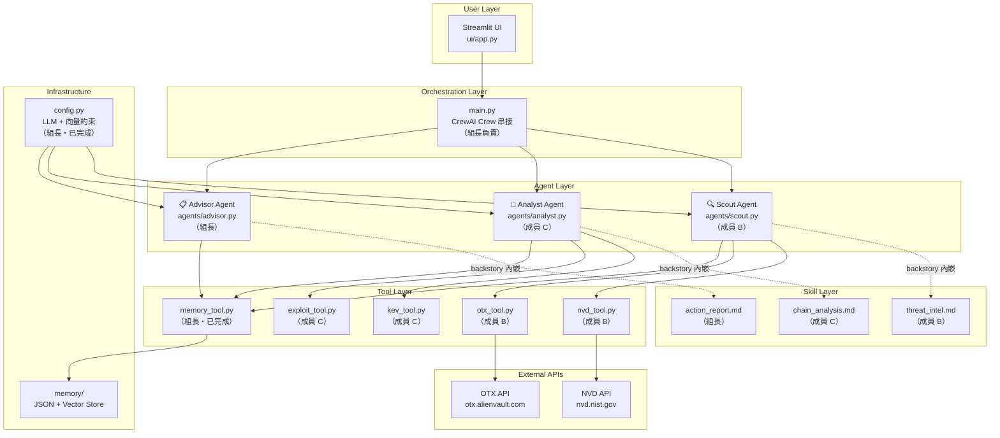

# 🏗️ ThreatHunter 架構書 — Scout Agent Pipeline 接口規格

> 版本：v1.0 | 2026-04-03
> 對象：組員 B（Scout Agent Pipeline 負責人）
> 定位：本文件定義你負責的所有模組的**接口契約**，確保與組長（Crew 串接 / Memory / UI）和成員 C（Analyst Agent）無縫整合。

---

## 1. 系統全局架構



---

## 2. 你的模組在 Pipeline 中的資料流

```
使用者輸入: "Django 4.2, Redis 7.0"
        │
        ▼
┌─────────────────────────────────────────────────────────┐
│  main.py (Crew orchestration)                           │
│                                                         │
│  tech_stack = parse_input(user_input)                   │
│  crew = Crew(                                           │
│      agents=[scout, analyst, advisor],                  │
│      tasks=[scout_task, analyst_task, advisor_task],     │
│      process=Process.sequential                         │
│  )                                                      │
│  result = crew.kickoff(inputs={"tech_stack": ...})      │
└────────────────┬────────────────────────────────────────┘
                 │
    ┌────────────▼────────────────┐
    │  🔍 Scout Task              │
    │  輸入：tech_stack string     │
    │  工具：search_nvd,           │
    │       search_otx,           │
    │       read_memory,          │
    │       write_memory,         │
    │       search_history        │
    │  輸出：ScoutOutput JSON     │  ← 你的接口契約（見 §3）
    └────────────┬────────────────┘
                 │ context 傳遞（CrewAI 自動）
    ┌────────────▼────────────────┐
    │  🧠 Analyst Task            │
    │  輸入：Scout 的完整 JSON     │
    │  消費你的：vulnerabilities[] │
    │  輸出：AnalystOutput JSON   │
    └────────────┬────────────────┘
                 │
    ┌────────────▼────────────────┐
    │  📋 Advisor Task            │
    │  輸入：Analyst 的 JSON      │
    │  輸出：Final Report         │
    └─────────────────────────────┘
```

> [!IMPORTANT]
> Scout 的輸出 JSON **直接決定** Analyst 能否正確解析。格式錯 → 整條 Pipeline 崩潰。

---

## 3. 接口契約：Scout Agent 輸出 JSON Schema

這是你的 Scout Agent 最終必須輸出的 JSON 格式。Analyst（成員 C）會直接 `json.loads()` 這個輸出。

### 3.1 完整 JSON Schema

```json
{
  "$schema": "http://json-schema.org/draft-07/schema#",
  "title": "ScoutOutput",
  "description": "Scout Agent 的結構化威脅情報輸出",
  "type": "object",
  "required": ["scan_id", "timestamp", "tech_stack", "vulnerabilities", "summary"],
  "properties": {
    "scan_id": {
      "type": "string",
      "pattern": "^scan_\\d{8}_\\d{3}$",
      "description": "掃描 ID，格式 scan_YYYYMMDD_NNN",
      "example": "scan_20260401_001"
    },
    "timestamp": {
      "type": "string",
      "format": "date-time",
      "description": "ISO 8601 時間戳"
    },
    "tech_stack": {
      "type": "array",
      "items": { "type": "string" },
      "description": "使用者輸入的技術堆疊",
      "example": ["django 4.2", "redis 7.0"]
    },
    "vulnerabilities": {
      "type": "array",
      "items": { "$ref": "#/definitions/Vulnerability" }
    },
    "summary": { "$ref": "#/definitions/Summary" }
  },
  "definitions": {
    "Vulnerability": {
      "type": "object",
      "required": ["cve_id", "package", "cvss_score", "severity", "description", "is_new"],
      "properties": {
        "cve_id": {
          "type": "string",
          "pattern": "^CVE-\\d{4}-\\d{4,}$",
          "description": "CVE 編號，必須來自 NVD API，不可編造"
        },
        "package": {
          "type": "string",
          "description": "受影響的套件名稱"
        },
        "cvss_score": {
          "type": "number",
          "minimum": 0.0,
          "maximum": 10.0,
          "description": "CVSS v3.1 分數"
        },
        "severity": {
          "type": "string",
          "enum": ["CRITICAL", "HIGH", "MEDIUM", "LOW"],
          "description": "嚴重度等級"
        },
        "description": {
          "type": "string",
          "description": "CVE 描述（來自 NVD）"
        },
        "is_new": {
          "type": "boolean",
          "description": "是否為新發現（與上次掃描比對）"
        },
        "otx_threat_level": {
          "type": "string",
          "enum": ["active", "inactive", "unknown"],
          "description": "OTX 活躍威脅等級（僅 CVSS >= 7.0 的 CVE 查詢）",
          "default": "unknown"
        },
        "affected_versions": {
          "type": "string",
          "description": "受影響的版本範圍（如有）"
        }
      }
    },
    "Summary": {
      "type": "object",
      "required": ["total", "new_since_last_scan", "critical", "high", "medium", "low"],
      "properties": {
        "total": { "type": "integer", "minimum": 0 },
        "new_since_last_scan": { "type": "integer", "minimum": 0 },
        "critical": { "type": "integer", "minimum": 0 },
        "high": { "type": "integer", "minimum": 0 },
        "medium": { "type": "integer", "minimum": 0 },
        "low": { "type": "integer", "minimum": 0 }
      }
    }
  }
}
```

### 3.2 完整範例輸出

```json
{
  "scan_id": "scan_20260401_001",
  "timestamp": "2026-04-01T10:00:00Z",
  "tech_stack": ["django 4.2", "redis 7.0"],
  "vulnerabilities": [
    {
      "cve_id": "CVE-2024-42005",
      "package": "django",
      "cvss_score": 9.8,
      "severity": "CRITICAL",
      "description": "Django QuerySet.values() SQL injection via crafted JSON field lookups",
      "is_new": true,
      "otx_threat_level": "active",
      "affected_versions": "Django 4.2 before 4.2.15, 5.0 before 5.0.8"
    },
    {
      "cve_id": "CVE-2024-41991",
      "package": "django",
      "cvss_score": 7.5,
      "severity": "HIGH",
      "description": "Django urlize and urlizetrunc potential denial-of-service",
      "is_new": true,
      "otx_threat_level": "inactive",
      "affected_versions": "Django 4.2 before 4.2.15"
    },
    {
      "cve_id": "CVE-2023-46136",
      "package": "redis",
      "cvss_score": 5.3,
      "severity": "MEDIUM",
      "description": "Redis ACL rules can be bypassed with SORT_RO command",
      "is_new": false,
      "otx_threat_level": "unknown",
      "affected_versions": "Redis 7.0 before 7.0.15"
    }
  ],
  "summary": {
    "total": 3,
    "new_since_last_scan": 2,
    "critical": 1,
    "high": 1,
    "medium": 1,
    "low": 0
  }
}
```

---

## 4. Tool 接口規格

### 4.1 `tools/nvd_tool.py` — NVD 漏洞查詢

```python
# ── 檔案：tools/nvd_tool.py ──
# CrewAI @tool 裝飾器包裝
# 成員 B 負責實作

from crewai.tools import tool

@tool("search_nvd")
def search_nvd(package_name: str) -> str:
    """
    查詢 NVD (National Vulnerability Database) 中指定套件的已知漏洞。
    
    Args:
        package_name: 套件名稱（如 "django", "redis", "postgresql"）
    
    Returns:
        JSON 字串，包含漏洞清單。格式見下方。
        失敗時回傳帶 error 欄位的 JSON（不會拋出例外）。
    """
```

#### API 端點

```
GET https://services.nvd.nist.gov/rest/json/cves/2.0
    ?keywordSearch={package_name}
    &resultsPerPage=20

Headers:
    apiKey: {NVD_API_KEY}  ← 從 os.getenv("NVD_API_KEY") 取得

Rate Limit:
    - 有 API Key: 50 requests / 30 seconds
    - 無 API Key: 5 requests / 30 seconds
    - 建議: time.sleep(0.6) between requests (有 key)
            time.sleep(6.0) between requests (無 key)
```

#### NVD API Response → Tool 輸出 Mapping

```
NVD API JSON 結構:
  response.vulnerabilities[].cve.id              → cve_id
  response.vulnerabilities[].cve.descriptions[0].value → description
  response.vulnerabilities[].cve.metrics.cvssMetricV31[0].cvssData.baseScore → cvss_score
  response.vulnerabilities[].cve.metrics.cvssMetricV31[0].cvssData.baseSeverity → severity

  備用路徑（部分 CVE 只有 v2）:
  response.vulnerabilities[].cve.metrics.cvssMetricV2[0].cvssData.baseScore → cvss_score
```

#### Tool 回傳格式（成功）

```json
{
  "package": "django",
  "source": "NVD",
  "count": 9,
  "vulnerabilities": [
    {
      "cve_id": "CVE-2024-42005",
      "cvss_score": 9.8,
      "severity": "CRITICAL",
      "description": "Django QuerySet.values() SQL injection...",
      "published": "2024-08-07T00:00:00Z",
      "affected_versions": "Django 4.2 before 4.2.15..."
    }
  ]
}
```

#### Tool 回傳格式（失敗 — Graceful Degradation）

```json
{
  "package": "django",
  "source": "NVD",
  "count": 0,
  "vulnerabilities": [],
  "error": "NVD API returned 403 (rate limited). Using empty result.",
  "fallback_used": false
}
```

#### 離線快取（Day 3+）

```python
# 快取機制：API 結果寫入 data/nvd_cache_{package}.json
# 下次 API 失敗時 → 讀取快取 → fallback_used: true
CACHE_DIR = "data/"
CACHE_TTL = 3600 * 24  # 24 小時過期
```

---

### 4.2 `tools/otx_tool.py` — OTX 威脅情報

```python
# ── 檔案：tools/otx_tool.py ──
from crewai.tools import tool

@tool("search_otx")
def search_otx(package_name: str) -> str:
    """
    查詢 AlienVault OTX 中指定套件的活躍威脅情報。
    僅在 CVSS >= 7.0 時由 Agent 決定呼叫。
    
    Args:
        package_name: 套件名稱
    
    Returns:
        JSON 字串，包含威脅情報。
    """
```

#### API 端點

```
GET https://otx.alienvault.com/api/v1/search/pulses
    ?q={package_name}
    &limit=10

Headers:
    X-OTX-API-KEY: {OTX_API_KEY}  ← os.getenv("OTX_API_KEY")

Rate Limit:
    - 10,000 requests / hour（寬鬆）
    - 建議: time.sleep(1.0) between requests
```

#### OTX API Response → Tool 輸出 Mapping

```
OTX API JSON 結構:
  response.results[].name              → pulse_name
  response.results[].description       → description
  response.results[].created           → created
  response.results[].indicators[].type → indicator_types（IOC 類型）
  response.results[].tags              → tags
  len(response.results)                → pulse_count（活躍度指標）
```

#### Tool 回傳格式

```json
{
  "package": "django",
  "source": "OTX",
  "pulse_count": 5,
  "threat_level": "active",
  "pulses": [
    {
      "name": "Django Critical SQLi CVE-2024-42005",
      "description": "Active exploitation observed...",
      "created": "2024-08-10",
      "tags": ["django", "sqli", "rce"],
      "indicator_count": 12
    }
  ]
}
```

#### `threat_level` 判定邏輯

```python
def _determine_threat_level(pulse_count: int, pulses: list) -> str:
    """
    pulse_count >= 3 且最近 90 天有新 pulse → "active"
    pulse_count >= 1 但都超過 90 天 → "inactive"
    pulse_count == 0 → "unknown"
    """
```

---

### 4.3 `tools/memory_tool.py` — 記憶工具（組長已完成 ✅）

你直接 import 使用，不需改動。

#### 已有接口

| Tool 名稱 | 函式簽名 | 說明 |
|---|---|---|
| `read_memory` | `read_memory(agent_name: str) -> str` | 讀取 JSON 歷史。agent_name=`"scout"` |
| `write_memory` | `write_memory(agent_name: str, data: str) -> str` | 雙寫 JSON + 向量索引 |
| `search_history` | `search_history(agent_name: str, query: str) -> str` | 語義搜尋歷史報告 |

#### 使用方式

```python
from tools.memory_tool import read_memory, write_memory, search_history

# 在 scout.py 中把這三個 tool 交給 Agent
scout_agent = Agent(
    tools=[search_nvd, search_otx, read_memory, write_memory, search_history],
    ...
)
```

> [!WARNING]
> `write_memory` 有一個 bug：第 252 行只傳了 `agent_name` 沒傳 `data`。
> ```python
> # 原始碼 line 252（有 bug）：
> return _write_memory_impl(agent_name)
> # 應修正為：
> return _write_memory_impl(agent_name, data)
> ```
> 已通知組長修復。在組長修復前，你的 Agent 測試中 write_memory 會出現 TypeError。

---

## 5. Agent 接口規格：`agents/scout.py`

### 5.1 Agent 定義結構

```python
# ── 檔案：agents/scout.py ──
from crewai import Agent
from config import llm
from tools.nvd_tool import search_nvd
from tools.otx_tool import search_otx
from tools.memory_tool import read_memory, write_memory, search_history

# Skill 內容（從 skills/threat_intel.md 讀取並嵌入 backstory）
SCOUT_SKILL = open("skills/threat_intel.md", "r", encoding="utf-8").read()

# 系統憲法（Constraints 支柱 — 層級 A）
CONSTITUTION = """
## 系統憲法 — 你必須遵守的規則
1. 所有 CVE 編號必須來自 search_nvd 工具的回傳結果，絕對不可自行編造
2. 所有 CVSS 分數必須來自 NVD API，不可自行估算
3. 輸出必須是且僅是 JSON 格式，不可有 JSON 以外的文字
4. 遇到查不到的套件，如實報告 count: 0，不可編造漏洞
5. 必須先呼叫 read_memory 讀取歷史，再開始查詢
"""

def create_scout_agent() -> Agent:
    return Agent(
        role="威脅情報偵察員 (Scout)",
        goal="從 NVD 和 OTX 公開資料庫收集指定技術堆疊的已知漏洞和活躍威脅，"
             "與歷史掃描比對差異，輸出結構化 JSON 情報清單",
        backstory=f"""你是一位資深的威脅情報分析師。
{CONSTITUTION}

## 分析方法論
{SCOUT_SKILL}
""",
        tools=[search_nvd, search_otx, read_memory, write_memory, search_history],
        llm=llm,
        verbose=True,
        max_iter=15,  # Harness: 防止無限迴圈
        allow_delegation=False,
    )
```

### 5.2 CrewAI Task 定義（組長在 `main.py` 中使用你的 Agent）

```python
# ── main.py 中的 Task 定義（組長負責，但你需要知道接口）──
from crewai import Task

scout_task = Task(
    description="""
    分析以下技術堆疊的安全漏洞：{tech_stack}
    
    步驟：
    1. 先讀取歷史記憶 (read_memory agent_name="scout")
    2. 對每個技術套件查詢 NVD 漏洞 (search_nvd)
    3. 高危 CVE (CVSS >= 7.0) 進一步查詢 OTX 威脅情報 (search_otx)
    4. 比對歷史記憶，標記 is_new
    5. 將結果寫入記憶 (write_memory agent_name="scout")
    6. 輸出完整 JSON 報告
    """,
    expected_output="結構化 JSON 格式的威脅情報清單，包含所有發現的 CVE、CVSS 分數、嚴重度和新舊標記",
    agent=scout_agent,
)

# Scout 的輸出會透過 context 自動傳給 Analyst
analyst_task = Task(
    description="...",  # 成員 C 負責
    agent=analyst_agent,
    context=[scout_task],  # ← 這裡接收你的輸出
)
```

---

## 6. Skill 接口規格：`skills/threat_intel.md`

Skill 檔案的內容會被**原文嵌入** Agent 的 `backstory`，引導 LLM 的 ReAct 推理。

### 6.1 必須包含的區塊

| 區塊 | 用途 | 必要性 |
|---|---|---|
| `## 目的` | 一句話描述 Agent 的職責 | ✅ 必要 |
| `## SOP（分析步驟）` | 明確的 1-2-3 步驟 | ✅ 必要 |
| `## 套件名稱對應` | 常見別名 mapping | ✅ 必要 |
| `## JSON 輸出範例` | 完整 JSON 範例（LLM 模仿用） | ✅ 必要 |
| `## 品質紅線` | 不可違反的規則 | ✅ 必要 |
| `## 嚴重度判定` | CVSS → severity 對應表 | 建議 |

### 6.2 Skill 與 Agent 的關係

```
threat_intel.md 內容
        │
        │ 嵌入
        ▼
scout.py → Agent(backstory=CONSTITUTION + SKILL)
        │
        │ CrewAI 自動執行 ReAct 迴圈
        ▼
Thought → Action(search_nvd) → Observation → Thought → Action(search_otx) → ...
```

---

## 7. 記憶學習系統接口

### 7.1 雙層架構

```
讀取流程：
  Scout 啟動
    → read_memory("scout")     ← Layer 1: JSON 精確取值（保底）
    → search_history("scout", "django vulnerabilities")  ← Layer 2: RAG 語義搜尋（增值）

寫入流程：
  Scout 完成掃描
    → write_memory("scout", json.dumps(scan_result))
       → 內部自動雙寫：
          ✅ Layer 1: memory/scout_memory.json（必須成功）
          ✅ Layer 2: memory/vector_store/scout/（失敗不阻斷）
```

### 7.2 `scout_memory.json` 結構

```json
{
  "latest": {
    "scan_id": "scan_20260401_001",
    "timestamp": "2026-04-01T10:00:00Z",
    "tech_stack": ["django 4.2", "redis 7.0"],
    "vulnerabilities": [...],
    "summary": {...},
    "agent": "scout"
  },
  "history": [
    { "scan_id": "scan_20260401_001", ... },
    { "scan_id": "scan_20260402_001", ... }
  ]
}
```

### 7.3 `is_new` 比對邏輯（你的 Skill 要引導 Agent 做的事）

```python
# Scout Agent 的 Thought 過程（由 Skill 引導）：
# 1. read_memory("scout") → 取得 latest.vulnerabilities
# 2. 提取所有歷史 cve_id → 組成 set
# 3. 本次掃描的每個 CVE：
#    if cve_id in historical_set → is_new = False
#    else → is_new = True
```

---

## 8. Sentinel 驗證系統接口（組長負責建置，你需要通過）

Scout 的每次輸出都會被 Sentinel 系統自動驗證三層：

### 8.1 Layer 1: Schema Validation

```python
# 驗證規則：
assert re.match(r'^CVE-\d{4}-\d{4,}$', cve_id)          # CVE 格式
assert 0.0 <= cvss_score <= 10.0                          # CVSS 範圍
assert severity in ["CRITICAL", "HIGH", "MEDIUM", "LOW"]  # 嚴重度列舉
assert isinstance(is_new, bool)                           # is_new 布林值
assert all(required_field in output for ...)              # 必要欄位齊全
```

### 8.2 Layer 2: Fact-Check

```python
# 每個 cve_id 回查 NVD API 驗證是否真實存在
for vuln in output["vulnerabilities"]:
    response = requests.get(f"https://services.nvd.nist.gov/rest/json/cves/2.0?cveId={vuln['cve_id']}")
    if response.json()["totalResults"] == 0:
        flag_as("FAIL_HALLUCINATION")  # ← 幻覺！Scout 編造了 CVE
```

### 8.3 Layer 3: Behavior Monitor

```python
# 檢查 Agent 的 verbose 日誌中是否有 Tool 呼叫痕跡
assert "Action: search_nvd" in verbose_log        # 有查 NVD
assert "Action: read_memory" in verbose_log        # 有讀歷史
# 如果沒有 → 標記 DEGRADED（Agent 靠幻覺而非 Tool）
```

---

## 9. 模組間依賴關係圖

```
config.py（已完成 ✅）
    ├── llm 實例 → 所有 Agent 共用
    └── check_constraint() → 向量約束檢查

tools/memory_tool.py（已完成 ✅）
    ├── read_memory
    ├── write_memory（⚠️ 有 bug，見 §4.3）
    └── search_history

tools/nvd_tool.py（❌ 你要寫）
    ├── search_nvd()
    ├── 依賴：requests, os, json, time, logging
    └── 環境變數：NVD_API_KEY

tools/otx_tool.py（❌ 你要寫）
    ├── search_otx()
    ├── 依賴：requests, os, json, time, logging
    └── 環境變數：OTX_API_KEY

agents/scout.py（❌ 你要寫）
    ├── create_scout_agent()
    ├── 依賴：config.llm, tools/nvd_tool, tools/otx_tool, tools/memory_tool
    └── 嵌入：skills/threat_intel.md

skills/threat_intel.md（❌ 你要寫）
    └── 純文字 SOP，不依賴任何模組
```

---

## 10. 套件名稱對應表（`data/package_map.json`）

Scout Agent 的 Skill 需引導 Agent 處理使用者輸入與 NVD 查詢之間的名稱差異。

```json
{
  "postgres": "postgresql",
  "pg": "postgresql",
  "node": "node.js",
  "nodejs": "node.js",
  "mongo": "mongodb",
  "py": "python",
  "rails": "ruby_on_rails",
  "vue": "vue.js",
  "react": "react",
  "angular": "angular",
  "express": "express.js",
  "flask": "flask",
  "django": "django",
  "redis": "redis",
  "nginx": "nginx",
  "apache": "apache_http_server",
  "mysql": "mysql",
  "mariadb": "mariadb",
  "spring": "spring_framework",
  "springboot": "spring_boot",
  "tomcat": "apache_tomcat",
  "docker": "docker",
  "k8s": "kubernetes",
  "kubernetes": "kubernetes"
}
```

---

## 11. 錯誤處理矩陣（Graceful Degradation）

| 情境 | 你的 Tool 應做的事 | Agent 行為 |
|---|---|---|
| NVD API 403 (rate limit) | `time.sleep(6)` → 重試一次 → 仍失敗 → 讀離線快取 → 回傳帶 `error` 欄位的 JSON | Agent 收到 error 但仍有資料可用 |
| NVD API 500 (server error) | 讀離線快取 → 回傳帶 `error` + `fallback_used: true` 的 JSON | Agent 如實報告 |
| NVD 查無結果 | 嘗試 package_map 別名 → 仍無 → 回傳 `count: 0` | Agent 跳過此套件 |
| OTX API 失敗 | 回傳 `threat_level: "unknown"` | Agent 跳過 OTX 數據 |
| `NVD_API_KEY` 未設定 | 無 Key 模式（慢速）→ `time.sleep(6)` | 功能正常但較慢 |
| `OTX_API_KEY` 未設定 | OTX 某些端點無需 Key → 嘗試 → 失敗 → `unknown` | 功能正常 |
| 網路完全離線 | 兩個 Tool 都讀離線快取 | Agent 使用快取資料 |

---

## 12. 測試接口

### 12.1 Tool 單元測試（Day 1 — 不需要 LLM）

```python
# tests/test_tools.py
from tools.nvd_tool import search_nvd  # 直接呼叫底層 _impl 函式
from tools.otx_tool import search_otx

def test_nvd_returns_valid_json():
    result = search_nvd._run("django")  # CrewAI tool 用 ._run()
    data = json.loads(result)
    assert "vulnerabilities" in data
    assert data["count"] >= 0

def test_nvd_handles_unknown_package():
    result = search_nvd._run("asdfghjkl_nonexistent")
    data = json.loads(result)
    assert data["count"] == 0
    # 不應 crash

def test_nvd_handles_api_error():
    # Mock requests.get → raise ConnectionError
    result = search_nvd._run("django")
    data = json.loads(result)
    assert "error" in data or data["count"] >= 0

def test_otx_returns_threat_level():
    result = search_otx._run("django")
    data = json.loads(result)
    assert data["threat_level"] in ["active", "inactive", "unknown"]
```

### 12.2 Agent 整合測試（Day 2 — 需要 LLM）

```python
# tests/test_scout_agent.py
from agents.scout import create_scout_agent
from crewai import Task, Crew, Process

def test_scout_produces_valid_json():
    scout = create_scout_agent()
    task = Task(
        description="分析以下技術堆疊的安全漏洞：django 4.2",
        expected_output="JSON 格式的威脅情報",
        agent=scout,
    )
    crew = Crew(agents=[scout], tasks=[task], process=Process.sequential)
    result = crew.kickoff()
    
    output = json.loads(str(result))
    assert "vulnerabilities" in output
    assert "summary" in output
    # Sentinel Layer 1: Schema Validation
    for vuln in output["vulnerabilities"]:
        assert re.match(r'^CVE-\d{4}-\d{4,}$', vuln["cve_id"])
        assert 0.0 <= vuln["cvss_score"] <= 10.0
```

---

## 13. 與其他成員的介面邊界

```
┌────────────────────────────────────────────────────────────────┐
│                       你的責任邊界                              │
│                                                                │
│  ✅ 你負責：                                                    │
│     tools/nvd_tool.py     — NVD API 查詢                       │
│     tools/otx_tool.py     — OTX API 查詢                       │
│     agents/scout.py       — Scout Agent 定義                    │
│     skills/threat_intel.md — Skill SOP 文件                     │
│     tests/test_tools.py   — Tool 單元測試                       │
│                                                                │
│  ❌ 不是你的：                                                   │
│     main.py              — 組長負責 Crew 串接                   │
│     config.py            — 組長已完成                           │
│     tools/memory_tool.py — 組長已完成（你只 import 使用）        │
│     tools/kev_tool.py    — 成員 C 負責                         │
│     tools/exploit_tool.py— 成員 C 負責                         │
│     agents/analyst.py    — 成員 C 負責                         │
│     agents/advisor.py    — 組長負責                             │
│     ui/app.py            — 組長負責                             │
│                                                                │
│  🤝 交接點：                                                    │
│     Scout JSON → context → Analyst（成員 C 消費你的輸出）       │
│     Scout 使用 read_memory / write_memory（組長提供）           │
│     Scout 使用 config.llm（組長提供）                           │
└────────────────────────────────────────────────────────────────┘
```

---

## 14. CVSS → Severity 對應表

| CVSS 分數 | Severity | 顏色 |
|---|---|---|
| 9.0 - 10.0 | `CRITICAL` | 🔴 |
| 7.0 - 8.9 | `HIGH` | 🟠 |
| 4.0 - 6.9 | `MEDIUM` | 🟡 |
| 0.1 - 3.9 | `LOW` | 🟢 |

> [!TIP]
> NVD API 回傳的 `baseSeverity` 就已經是 CRITICAL/HIGH/MEDIUM/LOW 了，優先使用 API 回傳值。
> 只在 `baseSeverity` 欄位缺失時，用上表自行換算。

---

## 15. 環境變數一覽

| 變數名 | 用途 | 預設值 | 你要設定？ |
|---|---|---|---|
| `LLM_PROVIDER` | LLM 供應商 | `openrouter` | ❌ 組長設好了 |
| `OPENROUTER_API_KEY` | OpenRouter API | — | ❌ 組長提供 |
| `NVD_API_KEY` | NVD API Key | — | ✅ **你要申請** |
| `OTX_API_KEY` | OTX API Key | — | ✅ **你要申請** |
| `VLLM_BASE_URL` | vLLM 位址 | `http://localhost:8000` | ❌ Day 4 才需要 |

### 申請連結
- NVD API Key: https://nvd.nist.gov/developers/request-an-api-key
- OTX API Key: https://otx.alienvault.com/api （註冊帳號即取得）

---

## 16. 檔案建立 Checklist

| 檔案 | 狀態 | Day |
|---|---|---|
| `tools/nvd_tool.py` | ✅ 已完成 + Harness 修正 | Day 1 |
| `tools/otx_tool.py` | ✅ 已完成 | Day 1 |
| `data/package_map.json` | ✅ 已完成 | Day 1 |
| `skills/threat_intel.md` | ✅ 已完成 (Placeholder機制) | Day 2 |
| `agents/scout.py` | ✅ 已完成 (具備 5層 Harness 防護) | Day 2 |
| `tests/test_tools.py` | ✅ 已完成 | Day 1 |
| `tests/test_scout_agent.py` | ✅ 已完成 | Day 2 |
