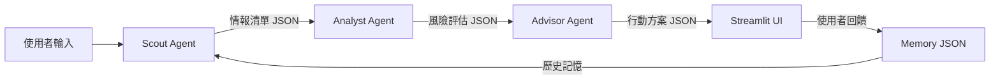

# ⚖️ ThreatHunter 專案憲法（PROJECT CONSTITUTION）

> **版本**：v1.0（初版）  
> **建立日期**：2026-04-01  
> **效力範圍**：本專案所有模組、文件、程式碼、測試、報告  
> **最高原則**：憲法條文優先適用，工程師明確指令二次確認後可覆蓋  

---

## 緒論：為何需要憲法

ThreatHunter 是一個多人協作的 AI Agent 系統，在 5 天 Hackathon 高壓環境下，  
成員容易因時間壓力而跳過規範、偷工減料、或各自為政。

**本憲法的目的：**

```
讓每個人都知道「什麼是對的做法」，
讓 AI 開發夥伴（Antigravity）有一致的行為準則，
讓審查者（評審、工程師）能快速驗證系統品質。
```

> 本憲法比任何特定功能的說明文件更高層，若有衝突，以本憲法為準。

---

## 第一條 ｜ 文件語言與報告規範

### 1.1 核心原則

**所有 `.md` 報告文件的語言限定為繁體中文（zh-TW）。**

| 項目 | 規定 |
|---|---|
| 報告語言 | 繁體中文（zh-TW） |
| 程式碼內註解 | 繁體中文（zh-TW） |
| 技術術語 | 保留英文原文（如 CVE、ReAct、CVSS） |
| Agent 輸出（JSON）| 英文（維持 FINAL_PLAN.md 之系統憲法） |
| 變數 / 函式名稱 | 英文（遵從 Python 慣例） |

### 1.2 報告結構規範

每份報告文件**必須包含**：

```
1. 架構圖（使用 ASCII art 或 Mermaid 圖表）
2. 模組說明（模組功能、輸入、輸出）
3. 資料流向（哪個 Agent 傳給哪個）
4. 已知限制與例外處理說明
```

### 1.3 架構圖強制要求

> 「圖勝千言。工程師在 Demo 現場的壓力下，沒時間讀長文。」

- 每個子模組文件**至少要有一張**架構圖或流程圖
- 推薦使用 Mermaid 或 ASCII Art
- 圖中需標記資料流向和關鍵決策點

**範例格式（Mermaid）：**



---

## 第二條 ｜ 最大化效能原則

### 2.1 核心精神

```
AI 開發夥伴（Antigravity）工作時，
不應因「節省 token」而縮減工作品質。

寧可多寫 200 行完整的程式，
也不要留下 TODO、stub、placeholder。
```

### 2.2 具體要求

| 行為 | 規定 |
|---|---|
| Token 使用 | 不設保守上限，完整實作優先 |
| 主動性 | 主動發現可強化的功能，不等待指令 |
| 功能深化 | 每個模組完成後提出 3 個以上強化路徑 |
| 長程編程 | 同一 session 可進行大規模多模組建設 |
| 程式碼品質 | 完整可運行，不留空殼 |

### 2.3 禁止行為

```
❌ 禁止回覆「這個功能較複雜，建議之後再做」——應直接開始做
❌ 禁止用 pass / # TODO 佔位而不實作
❌ 禁止因「可能超出 token」而主動縮減工作量
❌ 禁止在測試尚未通過時宣告模組「完成」
```

---

## 第三條 ｜ 外部資料引用規範

### 3.1 資料品質要求

引用外部資料時，**必須符合以下條件**：

```
✅ 高可信度來源（NVD、CISA、GitHub 官方、學術論文）
✅ 可驗證性（提供原始 URL 或 API endpoint）
✅ 時效性檢查（CVE 資料必須確認發布日期）
✅ 交叉比對（重要事實 ≥ 2 個來源確認）
```

### 3.2 CVE 資料特別規範（Agent 系統憲法延伸）

> 此條延伸自 FINAL_PLAN.md 的 ThreatHunter Constitution：

```
規則 CI-1：所有 CVE 編號必須來自 Tool 回傳的真實 API 資料
規則 CI-2：禁止 LLM 自行編造任何 CVE 編號或漏洞細節
規則 CI-3：CVE 資料若無法從 NVD/OTX 取得，必須標注 NEEDS_VERIFICATION
規則 CI-4：引用 CISA KEV 時必須使用最新快取（每次執行自動更新）
```

### 3.3 引用格式

文件中引用外部資料時，標記來源：

```markdown
> 資料來源：[NVD API v2](https://services.nvd.nist.gov/rest/json/cves/2.0)  
> 查詢日期：YYYY-MM-DD  
> 可驗證性：✅ 公開 API，無需授權
```

---

## 第四條 ｜ Agent Skills 使用規範

### 4.1 Skills 定義

本條的「Skills」指 **Antigravity 安裝的擴充技能包**，位於：
```
C:\Users\userback\.gemini\antigravity\skills
```

> 注意：此處的 Skills 與 ThreatHunter 系統內的 `skills/*.md`（Agent SOP 文件）是**不同層次的概念**。

### 4.2 使用規則

```
1. 若有已安裝的 Skill 適合當前任務 → 優先調用 Skill
2. 調用前必須用 view_file 讀取 SKILL.md 確認用法
3. 每次對話結束，必須向工程師報告：
   - 使用了哪個 Skill
   - 該 Skill 的功能簡介
```

### 4.3 報告格式（對話結束時）

```markdown
## 🛠️ 本次使用的 Skills

| Skill 名稱 | 功能說明 | 使用效果 |
|---|---|---|
| ui-ux-pro-max-skill | 專業 UI/UX 設計指引，含 Glassmorphism 等現代設計規範 | 用於 Streamlit UI 設計 |
```

---

## 第五條 ｜ 子模組測試規範

### 5.1 核心原則

> **「未測試 ≠ 完成」。**  
> **「測試通過才可交付給工程師」。**

### 5.2 每個子模組的測試要求

每完成一個子模組，必須**專門編寫一個測試程式**並自動執行：

```
測試覆蓋範圍：
  ✅ 基本功能正確性（Happy Path）
  ✅ 邊界情況（空輸入、極大值、格式錯誤）
  ✅ 錯誤處理（API 掛掉、網路逾時的 Graceful Degradation）
  ✅ 輸出格式驗證（JSON 結構是否符合 data_contracts.md）
```

### 5.3 測試命名規範

```
tests/
├── test_nvd_tool.py       # 測試 NVD Tool
├── test_otx_tool.py       # 測試 OTX Tool
├── test_kev_tool.py       # 測試 CISA KEV Tool
├── test_exploit_tool.py   # 測試 Exploit 搜尋 Tool
├── test_memory_tool.py    # 測試 Memory 讀寫
├── test_scout_agent.py    # 測試 Scout Agent 完整 ReAct 迴圈
├── test_analyst_agent.py  # 測試 Analyst Agent 連鎖分析
├── test_advisor_agent.py  # 測試 Advisor Agent 行動報告
└── test_integration.py    # 端對端整合測試
```

### 5.4 測試執行流程

```
1. 完成子模組開發
2. 編寫對應 test_*.py
3. 執行測試：python -m pytest tests/test_{module}.py -v
4. 若有失敗 → 修正後重跑，直到 100% 通過
5. 向工程師報告測試結果（含通過率和關鍵邊界案例結果）
6. 工程師確認後，方可視為「模組交付完成」
```

### 5.5 測試報告格式

```
模組：nvd_tool.py
測試結果：5/5 通過（100%）

✅ test_basic_query         - Django 4.2 回傳 9 筆 CVE
✅ test_empty_package       - 空字串回傳 [] 不崩潰
✅ test_rate_limit          - API 429 自動重試
✅ test_offline_fallback    - 網路斷線使用快取
✅ test_json_schema         - 輸出符合 Scout JSON 契約

邊界情況：套件名稱含特殊字元、CVSS 分數為 0 的 CVE、API 回傳空陣列
```

---

## 第六條 ｜ 架構書更新規範

### 6.1 核心原則

> **「寧可更新舊文件，也不要新增重複文件。」**

### 6.2 規則

```
當有功能異動（程式碼 PR 後），工程師要求更新架構書時：
  ✅ 在原有文件上直接更新：FINAL_PLAN.md、leader_plan.md 等
  ✅ 更新所有受影響模組的說明
  ✅ 在文件頂部更新版本號和日期
  ❌ 禁止隨意新增 FINAL_PLAN_v2.md、FINAL_PLAN_updated.md 等重複文件
  ❌ 禁止保留已過時的描述而不標注 [已棄用]
```

### 6.3 版本管理

每次更新文件時，在文件頂部標記：

```markdown
> **版本**：v2.1（新增 Memory 學習閉環說明）  
> **更新日期**：2026-04-XX  
> **異動摘要**：section 八新增 risk_trend 計算邏輯，section 三更新架構圖
```

### 6.4 現有核心文件清單

| 文件 | 職責 | 負責人 |
|---|---|---|
| `docs/CONSTITUTION.md` | 本文件，最高準則 | 組長 + AI |
| `docs/FINAL_PLAN.md` | 總架構計畫 | 組長 |
| `docs/leader_plan.md` | 組長詳細計畫 | 組長 |
| `docs/member_b_plan.md` | 成員 B 詳細計畫 | 成員 B |
| `docs/member_c_plan.md` | 成員 C 詳細計畫 | 成員 C |
| `docs/system_constitution.md` | Agent 行為約束（給 LLM 讀的） | 組長 |
| `docs/data_contracts.md` | JSON 資料契約規範 | 組長 |

---

## 第七條 ｜ 技術路線變更申請

### 7.1 需要申請的變更

以下情況**必須向工程師提出申請，並取得文字批准**：

```
🔴 需申請：
  - 更換 LLM 模型（如從 Llama 3.3 改為 Mistral）
  - 更換 Agent 框架（如從 CrewAI 改為 LangGraph）
  - 更換資料儲存方式（如從 JSON 改為 FAISS 向量資料庫）
  - 更換 UI 框架（如從 Streamlit 改為 Gradio）
  - 更換 API 來源（如從 NVD v2 改為非官方鏡像）
  - 新增重大依賴（影響 requirements.txt 的核心套件）
  
🟡 建議報告：
  - 調整 Agent 的 max_iter 設定
  - 修改 memory_tool.py 的 JSON 結構
  - 新增 Tool 數量
  
🟢 無需申請（自主決定）：
  - 優化程式碼效能
  - 增加測試覆蓋
  - 修正 Bug
  - 完善文件說明
```

### 7.2 申請格式

```markdown
## 🔄 技術路線變更申請

**申請日期**：YYYY-MM-DD  
**申請人**：AI 開發夥伴 / 成員 [X]  
**變更項目**：[具體描述]  
**變更原因**：[為何需要這個改變]  
**影響範圍**：[哪些模組受影響]  
**替代方案**：[有沒有其他做法]  
**風險評估**：[最壞情況是什麼]

請工程師批准後方可執行。
```

---

## 第八條 ｜ 功能交付後的三個優化路徑

### 8.1 原則

每次完成一個完整功能更新後，**必須附上 3 個下一步優化路徑**。

這 3 個優化路徑必須：

```
✅ 確定可行（技術上已驗證）
✅ 可靠（不會破壞現有功能）
✅ 可驗證（有明確的驗收標準）
✅ 有啟發性（能激發工程師靈感）
❌ 不可是模糊的「可以考慮加 AI 功能」等空泛描述
```

### 8.2 格式範例

```markdown
## 🚀 下一步三個優化路徑

### 路徑 A：CVE 歷史趨勢圖表化（可行性：⭐⭐⭐⭐⭐）
**目標**：在 Streamlit UI 加入 risk_score 時序折線圖
**實作方式**：讀取 advisor_memory.json 的歷史 risk_score，用 st.line_chart() 渲染
**驗收標準**：掃描 3 次後，圖表顯示風險趨勢（升/降/持平）
**預估工時**：2 小時

### 路徑 B：Exploit PoC 相似度分析（可行性：⭐⭐⭐⭐）
**目標**：將找到的 GitHub PoC 與已知攻擊模式比對，判斷實際威脅程度
**實作方式**：用 TF-IDF 簡單向量化 README，計算餘弦相似度
**驗收標準**：對同一 CVE 的不同 PoC 能給出相似度分數
**預估工時**：4 小時

### 路徑 C：Slack/Discord 即時警報推送（可行性：⭐⭐⭐⭐⭐）
**目標**：CRITICAL 漏洞發現後，自動推送通知給工程師
**實作方式**：Webhook 整合，Advisor 輸出 URGENT 時觸發
**驗收標準**：Demo 時可展示「發現高危漏洞，自動通知」的完整流程
**預估工時**：2 小時
```

---

## 第九條 ｜ 第一性原理技術解說

### 9.1 適用時機

當工程師表示**對技術細節或程式設計不理解**時，  
優先使用**第一性原理（First Principles）**方式解說。

### 9.2 第一性原理解說格式

```
步驟 1：從最基本的事實出發（不引用現有框架假設）
步驟 2：用最簡單的比喻讓概念具象化
步驟 3：逐步從基礎推導到複雜概念
步驟 4：最後回到具體程式碼，連結理論與實作
```

### 9.3 範例（ReAct 是什麼）

```
第一性原理解說：

問：ReAct 到底是什麼？從最基礎說起。

基本事實 1：LLM 本質是一個接受文字、輸出文字的函數
基本事實 2：LLM 本身不能執行程式、不能上網

從這兩個事實出發：
  →「如果 LLM 想要查 CVE，它能怎麼辦？」
  →「它唯一能做的是輸出文字，所以它輸出：Action: search_nvd("Django 4.2")」
  →「程式讀到這段文字 → 真正呼叫 NVD API → 把結果貼回給 LLM」
  →「LLM 再基於結果輸出下一步」

這個循環就是 ReAct：
  Reason（推理）：LLM 想想下一步
  Act（行動）：LLM 輸出 Action，程式執行
  Observe（觀察）：把結果回傳給 LLM

所以 ReAct 不是什麼魔法，
它是「LLM 輸出文字 → 程式解析執行 → 把結果給 LLM」的迴圈。
```

---

## 第十條 ｜ 憲法衝突處理程序

### 10.1 衝突定義

**明顯衝突**（需要觸發本條）：
```
工程師的即時指令，與本憲法某條文的規定，
在同一個行為上產生直接矛盾。

例：憲法規定「不新增重複 .md 文件」，
    工程師指令「幫我新增 FINAL_PLAN_v2.md」
→ 這是明顯衝突 → 觸發本條程序
```

**不算衝突**（直接遵循工程師指令）：
```
- 憲法沒有明確規範的情況（模糊情況）
- 工程師補充說明了特殊原因
- 本地的 context-specific 決定
```

### 10.2 衝突處理流程

```
步驟 1：告知工程師衝突項目
  ──────────────────────────────
  「⚠️ 憲法衝突提示」
  您的指令：[工程師的指令]
  衝突條文：憲法第 X 條，規定：[條文內容]
  
  請問是否仍要執行此指令？

步驟 2：等待工程師明確確認

步驟 3：若工程師再次確認 → 無視憲法，以工程師決定為準
         若工程師取消 → 依原憲法條文執行
```

### 10.3 憲法修訂

工程師可隨時修訂本憲法，  
修訂後在文件頂部更新版本號和異動說明。

---

## 附錄 A：ThreatHunter Agent 系統憲法（摘錄）

> 此為寫入每個 Agent system prompt 的行為約束（英文版，供 LLM 閱讀）

```
=== ThreatHunter Constitution ===
1. All CVE IDs must come from Tool-returned data. Fabrication is prohibited.
2. You must use the provided Tools for queries. Skip is not allowed.
3. Output must conform to the specified JSON schema.
4. Uncertain reasoning must be tagged with confidence: HIGH / MEDIUM / NEEDS_VERIFICATION.
5. Each judgment must include a reasoning field.
6. Reports use English; technical terms are not translated.
7. Do not call the same Tool twice for the same data.
```

---

## 附錄 B：Harness Engineering 五根支柱快查表

| 支柱 | 核心問題 | 本專案實作 | 負責人 |
|---|---|---|---|
| Constraints（約束）| Agent 不會做什麼壞事？ | 系統憲法 + backstory SOP | 組長 |
| Observability（可觀測）| 能看到 Agent 在幹嘛嗎？ | verbose=True + UI 推理展示 | 組長 |
| Feedback Loops（回饋）| Agent 能從結果學習嗎？ | Memory JSON + 使用者回饋 | 組長 |
| Graceful Degradation（降級）| 出錯時不崩潰？ | try-except + 離線快取 | 全員 |
| Evaluation（驗證）| 怎麼知道做對了？ | 測試驗收 + 信心度標記 | 全員 |

---

## 附錄 C：憲法版本歷史

| 版本 | 日期 | 異動說明 | 批准人 |
|---|---|---|---|
| v1.0 | 2026-04-01 | 初版建立，10 條核心原則 | 組長 |

---

*本文件由 AI 開發夥伴（Antigravity）根據組長指示起草，以 ThreatHunter 專案需求為基礎深化延展。*  
*有效期：整個 Hackathon 期間（含賽前準備至 Demo 當天）。*
